# ToolEMZ User Manual

**Dacon Inspection Studio — EMSENZ Data Viewer & Analysis Tool**

*Version: 2026 — English Edition*

---

## Table of Contents

1. [Introduction](#1-introduction)
2. [Supported File Formats](#2-supported-file-formats)
3. [Getting Started](#3-getting-started)
4. [Main Application Window](#4-main-application-window)
5. [Menu Reference](#5-menu-reference)
6. [C-Scan Viewer](#6-c-scan-viewer)
7. [Data Viewer & Graphs](#7-data-viewer--graphs)
8. [EMZ Project — Merging Multiple Data Files](#8-emz-project--merging-multiple-data-files)
9. [Pattern & Alignment](#9-pattern--alignment)
10. [Data Conversion (RAWEMZ → EMZ)](#10-data-conversion-rawemz--emz)
11. [Note System](#11-note-system)
12. [Spool Floor Analysis](#12-spool-floor-analysis)
13. [Calibration](#13-calibration)
14. [Calculation Formula](#14-calculation-formula)
15. [Filtering (Moving Average / Median / Savitzky–Golay)](#15-filtering-moving-average--median--savitzkygolay)
16. [Live Data Display](#16-live-data-display)
17. [3D Pipe Visualization](#17-3d-pipe-visualization)
18. [Report Generation](#18-report-generation)
19. [Data Download from Acquisition Hardware](#19-data-download-from-acquisition-hardware)
20. [Keyboard & Mouse Reference](#20-keyboard--mouse-reference)
21. [Appendix A — File Format Specifications](#appendix-a--file-format-specifications)
22. [Appendix B — Glossary](#appendix-b--glossary)

---

## 1. Introduction

**ToolEMZ** is the EMSENZ (Electromagnetic Sensing) module of the Dacon Inspection Studio application. It provides a comprehensive environment for viewing, analysing, and reporting electromagnetic inspection data collected by in-line inspection (ILI) tools. The tool is designed for pipeline inspection engineers and data analysts who work with hardness mapping data.

### Key Capabilities

- Open and view `.emz` single-file data and `.EMZProj` multi-file projects
- Display C-scan heat maps for up to five sensor channels (HV, Ratio, V1, V3, V5)
- Convert raw data (`.rawemz`) to processed EMZ files using GPU-accelerated filtering
- Merge data from multiple data loggers (up to 256 channels across 4 data loggers)
- Apply pattern files and distance-based alignment for sensor remapping
- Perform spool floor analysis with adaptive thresholding
- Generate Word reports and dig-up sheets
- View real-time live data from the acquisition hardware
- Render 3D pipe surface models with C-scan textures

---

## 2. Supported File Formats

### `.emz` — EMZ Data File

The primary processed data format. Each file contains a header followed by sequential records:

| Field | Type | Description |
|-------|------|-------------|
| Sample Counter | UINT32 | Sequential record index |
| V1 Amplitude | UINT16 | 1st harmonic (3 kHz) |
| V3 Amplitude | UINT16 | 3rd harmonic (9 kHz) |
| V5 Amplitude | UINT16 | 5th harmonic (15 kHz) — V1.1 only |
| Odometer Counts | INT32 | Signed odometer values (up to 3 odometers) |
| Odometer Phases | INT16 | Signed phase data |

**File versions:**

| Version | Harmonics | Description |
|---------|-----------|-------------|
| V1.0 | V1, V3 | 3 kHz and 9 kHz |
| V1.1 | V1, V3, V5 | 3 kHz, 9 kHz, and 15 kHz |

### `.EMZProj` — EMZ Project File

An XML-based project file that references multiple data files from the same inspection run. It logically merges data from several data loggers into a single view.

```xml
<Project FileCount="4">
  <File1 Name="DL1\data.emz" DelayInSecond="0.0" />
  <File2 Name="DL2\data.emz" DelayInSecond="0.5" />
  <File3 Name="DL3\data.emz" DelayInSecond="1.0" />
  <File4 Name="DL4\data.emz" DelayInSecond="1.5" />
</Project>
```

**Supported file types within a project:** `.emz`, `.imu`, `.db`, `.csv`, `.txt`, `.odom`

### `.rawemz` / `.RAWEMZ` — Raw EMZ Data File

Raw binary data captured directly from the data loggers before signal processing. These files are typically very large (hundreds of GB for long inspections) and need to be converted to `.emz` format for analysis.

---

## 3. Getting Started

### Opening a Single EMZ File

1. Launch Dacon Inspection Studio.
2. Go to **File → Open** and select an `.emz` file.
3. The C-scan viewer will load and display the data.

### Opening an EMZ Project

1. Go to **File → Open** and select an `.EMZProj` file.
2. The application loads all referenced data files, merging them into a unified view.
3. Each file's delay offset is applied automatically.

### Creating a New EMZ Project

1. Go to **File → New → EMZ Project**.
2. Use the toolbar buttons to **Add** EMZ files to the project.
3. Reorder files using **Up / Down** buttons.
4. Set per-file **Delay (seconds)** values for time alignment.
5. **Save** the project as an `.EMZProj` file.

---

## 4. Main Application Window

The application uses an MDI (Multiple Document Interface) layout. When an EMZ file or project is opened, the workspace displays:

| Area | Description |
|------|-------------|
| **Menu Bar** | File, Tools, EMZ Sensors, View, Window, Help |
| **Toolbar** | Quick-access buttons for common actions |
| **C-Scan Preview** | Full-length overview of the pipe data (heat map) |
| **C-Scan Zoom** | Detailed zoomed view of the selected region |
| **Plot Scan** | Line plot of signal values at the cursor position |
| **Graph Panel** | B-scan graphs (odometer, distance, raw signal, HV, tool top) |
| **Note Table** | Tabular view of annotations and defect markings |

---

## 5. Menu Reference

### 5.1 File Menu

| Menu Item | Description |
|-----------|-------------|
| New → EMZ Project | Create a new `.EMZProj` project file |
| Open | Open `.emz` or `.EMZProj` files |
| Save / Save As | Save the current project |
| Exit | Close the application |

### 5.2 Tools Menu

| Menu Item | Description |
|-----------|-------------|
| EMZ Note File | Open or create an EMZ note database |
| Generate raw EMZ file | Generate synthetic `.rawemz` data for testing |
| Convert .RAWEMZ to .EMZ | Convert a single raw file to processed EMZ |
| Batch Convert .RAWEMZ to .EMZ | Batch-convert an entire folder of raw files |
| Extract Partial .RAWEMZ | Extract a time segment from a raw data file |

### 5.3 EMZ Sensors Menu

This is the primary menu for data interaction and is available when an EMZ file is open.

| Menu Item | Description |
|-----------|-------------|
| **Sensors** | |
| HV | Display Hardness Value (calculated) |
| Ratio | Display V3/V1 ratio |
| V3 | Display 3rd harmonic (9 kHz) amplitude |
| V1 | Display 1st harmonic (3 kHz) amplitude |
| V5 | Display 5th harmonic (15 kHz) amplitude |
| **Mouse Mode** | |
| Normal | Standard navigation mode |
| Add Notes | Click on C-scan to add annotation notes |
| Add Welds | Click on C-scan to mark girth welds |
| Hide Channels | Click channels on C-scan to hide them |
| **X-Axis Value** | |
| Time | Display time on the horizontal axis |
| Index | Display sample index on the horizontal axis |
| Odometer 1–3 | Display odometer distance on the horizontal axis |
| **View Options** | |
| Properties | Open the C-scan properties dialog |
| Super Sample | Enable super-sampling for smoother rendering |
| Enable Max/Min | Show maximum and minimum defect markers on C-scan |

### 5.4 EMZ Graph Menu

| Menu Item | Description |
|-----------|-------------|
| Display Odo Line — Odo 0 | Show unified odometer graph |
| Display Odo Line — Odo 1 | Show odometer 1 graph |
| Display Odo Line — Odo 2 | Show odometer 2 graph |
| Display Odo Line — Odo 3 | Show odometer 3 graph |

### 5.5 EMZ Live Data Menu

| Menu Item | Description |
|-----------|-------------|
| Light Properties | Adjust 3D lighting parameters |
| Parameter | Configure live data parameters |
| Exit | Close the live data view |

---

## 6. C-Scan Viewer

The C-scan viewer is the central component of ToolEMZ. It provides a colour-coded heat map of sensor data across the pipe circumference (vertical axis) and along the pipe length (horizontal axis).

### 6.1 Data Planes

The C-scan can display five data planes, each representing a different aspect of the electromagnetic measurement:

| Data Plane | Matrix Name | Description |
|------------|-------------|-------------|
| HV | matHV | Hardness Value — calculated from harmonic ratio and calibration |
| Ratio | matRatio | V3/V1 ratio — primary indicator of material hardness |
| V1 | matV1 | 1st harmonic amplitude (3 kHz fundamental) |
| V3 | matV3 | 3rd harmonic amplitude (9 kHz) |
| V5 | matV5 | 5th harmonic amplitude (15 kHz) — requires V1.1 file format |

### 6.2 Preview and Zoom

The viewer operates in two modes:

- **Preview Mode** — Displays the full pipe length. A navigation rectangle (box widget) allows you to select the region to zoom into.
- **Zoom Mode** — Displays the selected region in detail with crosshair cursor for precise data reading.

The crosshair uses a dedicated overlay renderer for smooth, responsive tracking without re-rendering the entire chart.

> *PR #531: Improved crosshair responsiveness with overlay renderer — crosshair actors are rendered in the overlay layer for fast, smooth updates without re-rendering the main chart.*


*Figure 6.1 — Box widget for zoom navigation in the C-scan preview.*

### 6.3 Color Settings

Each data plane can have its own color table. Available color options include:

- **RGB (Red-Green-Blue)** gradient
- **Inverted** color scales
- **Custom min/max range** adjustment
- **Resolution** control for color quantization

Color settings are accessible via **EMZ Sensors → Properties** or the C-scan properties dialog.

### 6.4 Max/Min Defect Markers

When **Enable Max/Min** is active, the viewer highlights the maximum and minimum values within the visible region, helping analysts quickly locate potential defects.

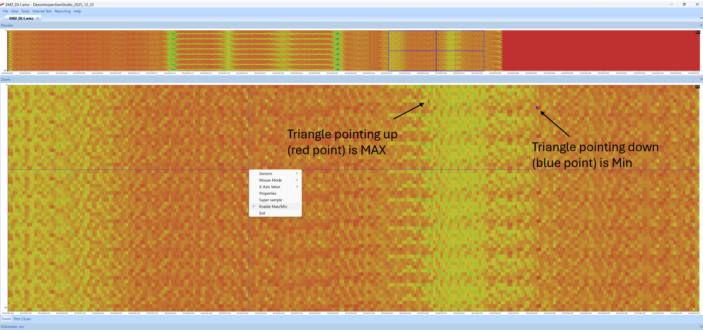
*Figure 6.2 — Max/Min defect markers displayed on the C-scan.*

---

## 7. Data Viewer & Graphs

### 7.1 Graph Types

The data viewer supports six graph types displayed below the C-scan:

| Graph | Description |
|-------|-------------|
| Odometer Count | Raw odometer encoder counts (signed) |
| Odometer Angle | Phase angle of the odometer |
| Distance | Calculated distance from odometer data |
| Raw Signal | Unprocessed waveform from the sensor |
| Hardness Value | Computed HV along the pipe length |
| Tool Top | Tool orientation data from IMU |

### 7.2 Waveform Viewer

The waveform viewer provides an A-scan display at the cursor position. Zoom controls:

| Action | Effect |
|--------|--------|
| Left-Click + Vertical Drag | Zoom Y-axis |
| Left-Click + Horizontal Drag | Zoom X-axis |
| Right-Click + Drag | Pan the view |
| Right-Click (no drag) | Reset zoom to full range |

### 7.3 X-Axis Options

The horizontal axis can be switched between:

- **Time** — absolute time from start of inspection
- **Sample Index** — sequential record number
- **Odometer 1 / 2 / 3** — distance from individual odometers
- **Odometer 0 (Unified)** — combined odometer using the most reliable reading per interval

> The unified odometer selects the highest-change reading per 1-second interval across all three odometers to handle mechanical vibration, slippage, and bend effects.

---

## 8. EMZ Project — Merging Multiple Data Files

### 8.1 Overview

A typical EMSENZ ILI tool uses multiple data loggers (up to 4), each capturing 64 channels. The EMZ Project feature merges these data sources into a single logical view of up to 256 channels.

### 8.2 Creating a Project

1. **File → New → EMZ Project** opens the project dialog.
2. Use the toolbar buttons:
   - **Add** — Browse and add `.emz` files
   - **Delete** — Remove selected file
   - **Up / Down** — Reorder files
3. Set the **Delay (seconds)** for each file to compensate for data logger synchronization offsets.
4. **Save** the project.

### 8.3 How Merging Works

- Each file in the project is loaded by a separate data access thread.
- Records are merged using the configured delay offsets.
- The firmware version is validated across all files to ensure compatibility.
- The total record count is determined by the file with the maximum records.

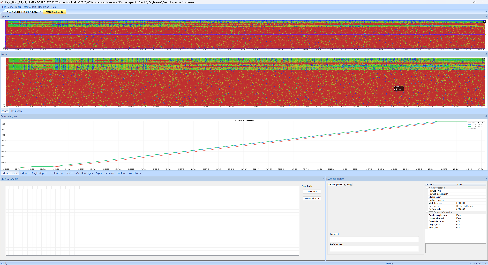
*Figure 8.1 — Single EMZ file displayed in C-scan viewer.*

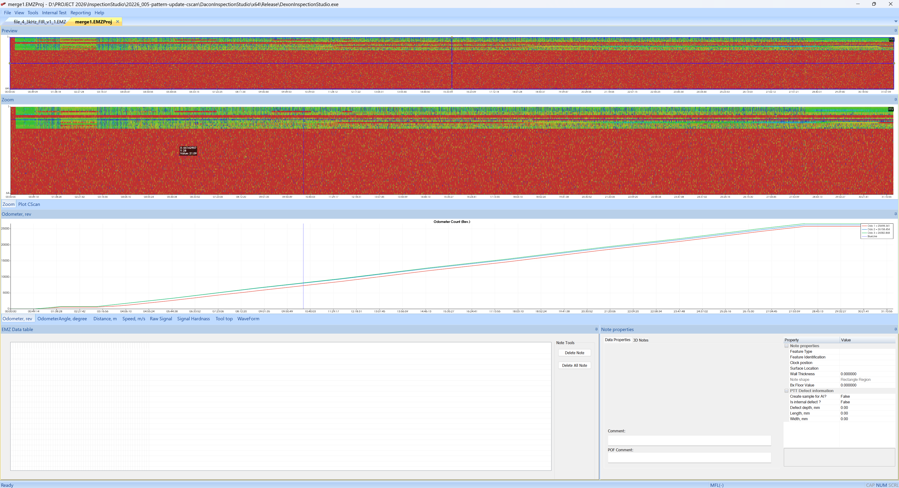
*Figure 8.2 — Multiple EMZ files merged via pattern file, showing all data loggers combined.*

---

## 9. Pattern & Alignment

### 9.1 Pattern File

The pattern file defines the physical arrangement of sensor coils across multiple data loggers. Because coils from different data loggers are interleaved on the tool body, the pattern file remaps channels to their correct circumferential position.

**Access:** Open via the C-scan properties dialog → **Pattern** tab, or via **EMZ Sensors → Properties**.

### 9.2 Alignment File

The alignment file specifies the axial distance offset for each channel. This compensates for the fact that sensor coils are not all at the same longitudinal position on the tool.

**Example alignment values:**
```
0, 0.3, 0.6, 0.9, 0, 0.3, 0.6, 0.9, ...
```

Each value (in metres) represents how far forward or backward each channel's data should be shifted.

### 9.3 Alignment Modes

Two alignment modes are available:

- **Alignment by Distance** — Uses odometer distance data for precise spatial alignment
- **Alignment by Time** — Uses timestamp data for temporal alignment

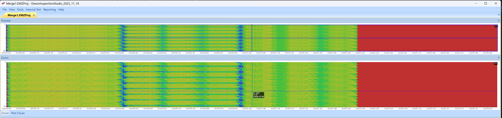
*Figure 9.1 — Data Logger 1 data before alignment.*

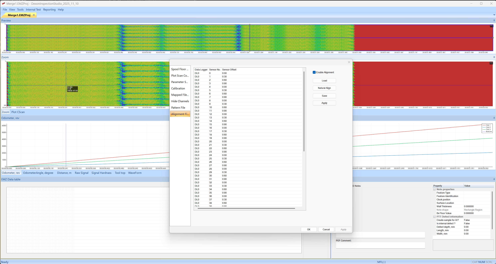
*Figure 9.2 — Data Logger 1 data after applying alignment file with distance offsets.*

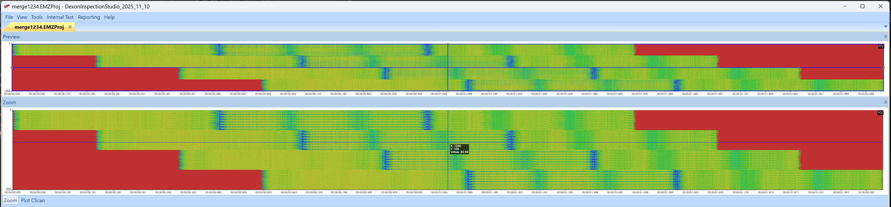
*Figure 9.3 — Four data loggers merged without alignment.*

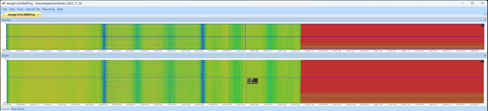
*Figure 9.4 — Four data loggers merged with alignment file applied.*

### 9.4 Advanced Alignment (Project-Level)

When working with EMZ projects, alignment can be applied at the project level:

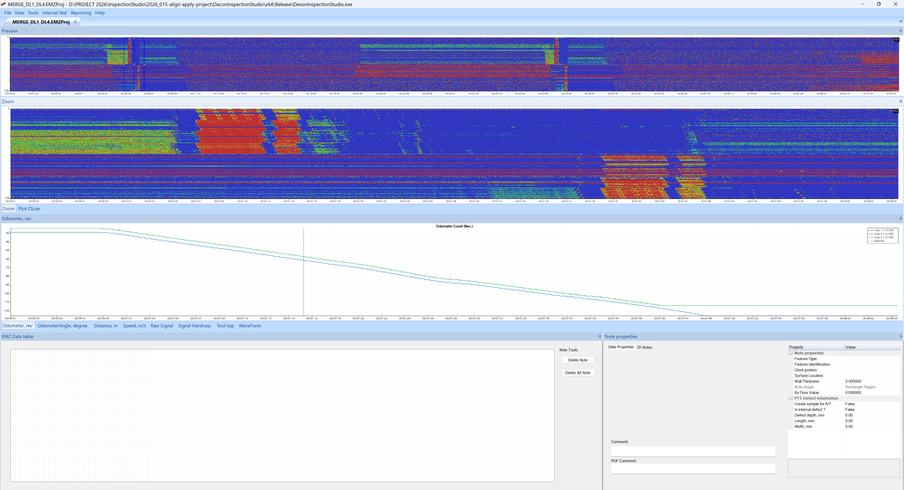
*Figure 9.5 — Project view: DL1 + DL4 merged.*

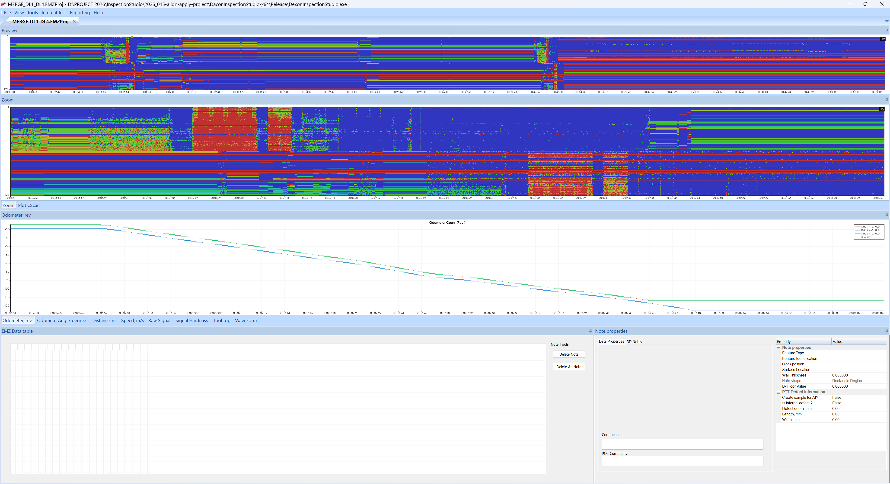
*Figure 9.6 — Alignment by distance applied to the project.*

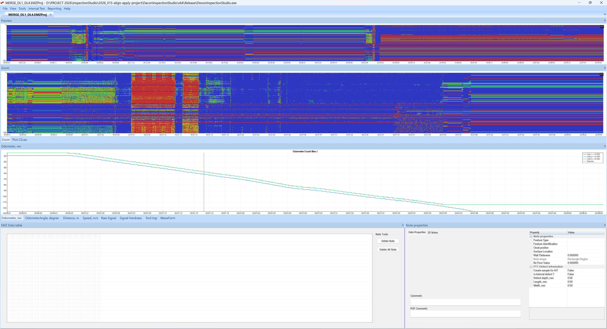
*Figure 9.7 — Alignment by time applied to the project.*

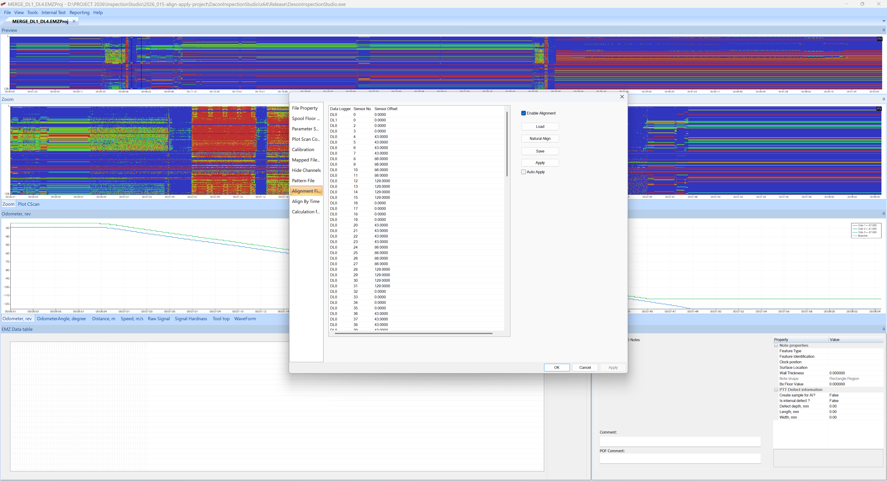
*Figure 9.8 — Alignment settings dialog.*

---

## 10. Data Conversion (RAWEMZ → EMZ)

### 10.1 Single File Conversion

**Access:** Tools → Convert .RAWEMZ to .EMZ

The conversion dialog allows you to:

1. Select the input `.rawemz` file
2. Choose the output axial sampling frequency: **500 Hz, 1 kHz, 2 kHz, or 5 kHz**
3. Select the conversion mode:
   - **Legacy (FFT)** — Standard Fast Fourier Transform processing
   - **GPU FIR Overlapping** — CUDA-accelerated FIR filtering (requires NVIDIA GPU)
4. Start the conversion

**Performance:**

| Method | 1-hour inspection | Data Reduction |
|--------|-------------------|----------------|
| Legacy FFT | ~30 seconds | ~94% |
| GPU FIR | ~20–30 seconds | ~96% |

The GPU FIR method uses CUDA for parallel processing with a unity-gain narrow-band bandpass FIR filter and Blackman windowing to minimize harmonic ratio errors.

### 10.2 Batch Conversion

**Access:** Tools → Batch Convert .RAWEMZ to .EMZ

1. Select a folder containing multiple `.rawemz` files.
2. Define the output sampling frequency.
3. The conversion runs as a job queue, processing files sequentially.

### 10.3 Partial Extraction

**Access:** Tools → Extract Partial .RAWEMZ

Extracts a time segment from a large `.rawemz` file, useful for isolating specific sections of an inspection run for detailed analysis.

### 10.4 Conversion from Live Data Stream

When the live data stream is stopped, the application prompts the user to convert the recorded `.rawemz` file to `.emz` format. The conversion runs in a background thread.

> *PR #453: After live data streaming stops, the file handle is closed properly and the user is prompted to convert .RAWEMZ to .EMZ using a background conversion thread.*

---

## 11. Note System

### 11.1 Overview

The note system allows analysts to annotate the C-scan with observations, defect markings, and weld locations. Notes are stored in a database format (SQLite or MS Access).

### 11.2 Adding Notes

1. Switch to **Add Notes** mouse mode via EMZ Sensors → Mouse Mode → Add Notes.
2. Click on the C-scan zoom view to place a note at that location.
3. Fill in the note properties in the dialog that appears.

### 11.3 Adding Welds

1. Switch to **Add Welds** mode via EMZ Sensors → Mouse Mode → Add Welds.
2. Click on the C-scan to mark a girth weld location.

### 11.4 Note Table Synchronization

The note table displays all annotations in a tabular format. It is synchronized with the C-scan zoom view — hovering over a note in the table highlights it on the C-scan, and vice versa.

> *PR #511: Added synchronization between C-scan zoom and Note table. Hovering is supported in the C-scan zoom view (Add Note and Add Weld modes operate separately). In the table view, hovering works in all modes.*


*Figure 11.1 — Synchronized note table and C-scan zoom view.*

### 11.5 Note Properties

Notes contain the following information:

| Property | Description |
|----------|-------------|
| ID | Unique identifier (primary key) |
| Category | ANOM, WELD, COCL, CORR, MIAN, LAMI, CRAL, DENP, etc. |
| Location | Distance and circumferential position |
| Dimensions | Width and length (based on sizing criteria) |
| HV Value | Hardness value at the note location |
| Threshold | Difference threshold used for sizing |

---

## 12. Spool Floor Analysis

### 12.1 Overview

Spool floor analysis determines the baseline signal level for each pipe section (typically between welds). Defects are then identified as deviations above this baseline.

### 12.2 Configuration

**Access:** EMZ Sensors → Properties → **Spool Floor** tab

| Parameter | Description |
|-----------|-------------|
| Threshold (%) | Percentage above floor value to trigger detection (e.g. 115%) |
| Delete Sections | Remove specific pipe sections from analysis |
| Blob Filter | Filter small blobs by minimum width and length |
| Save / Load | Persist spool floor parameters to file |

### 12.3 Adaptive Thresholding

The pipeline is divided into sections (by weld position). Each section has its own floor value, and the threshold is calculated as a percentage of that floor. This adaptive approach handles variations in pipe material and wall thickness along the pipeline.

---

## 13. Calibration

### 13.1 Ratio Calibration

**Access:** EMZ Sensors → Properties → **Calibration** tab

The calibration page allows adjustment of the V1, V3, and V5 multiplication factors to compensate for non-uniform coil properties. After adjusting the values, press **Start Processing** to recalculate the C-scan.

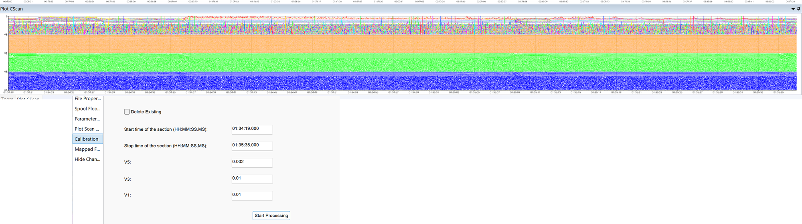
*Figure 13.1 — Ratio calibration dialog with V5, V3, and V1 adjustment controls.*

### 13.2 9 kHz Compensation

Available in both manual and automatic modes:

- **Manual Mode** — Adjust phase (2048 levels), amplitude/digital potentiometer (256 levels), and sine wave table per channel.
- **Automatic Mode** — Coarse-to-fine optimization strategy that tunes all 64 channels in under 1 minute.

---

## 14. Calculation Formula

**Access:** EMZ Sensors → Properties → **Calc Formula** tab

The formula property page allows users to define and adjust the mathematical formula used to convert raw harmonic data into hardness values (HV). The formula rendering uses LaTeX-style display for clarity.

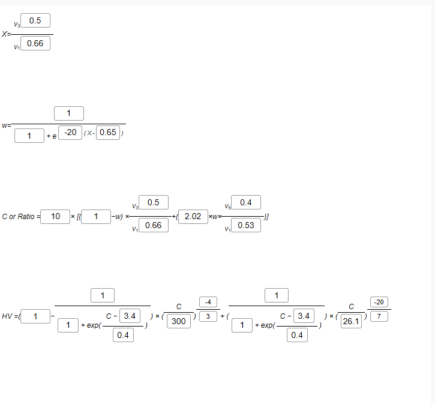
*Figure 14.1 — Calculation formula property page with LaTeX rendering.*

Additional formula options include:

- **Show Border** toggle for formula display
- Speed calculation accuracy improvement using sample indices
- Configurable formula parameters for different inspection scenarios

---

## 15. Filtering (Moving Average / Median / Savitzky–Golay)

ToolEMZ provides several filtering options to improve C-scan visualization and reduce noise:

### 15.1 Available Filters

| Filter | Parameters | Description |
|--------|-----------|-------------|
| Moving Average | Window size | Simple sliding window average |
| Median | Window size | Non-linear filter that preserves edges |
| Savitzky–Golay | Window size, Polynomial order | Smoothing filter that preserves peaks and valleys |

### 15.2 Comparison

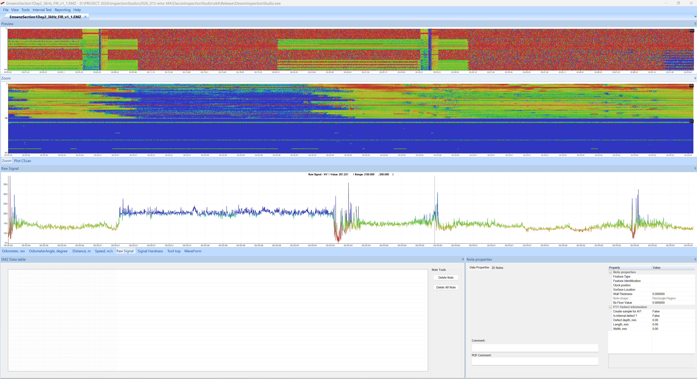
*Figure 15.1 — C-scan with no filter applied.*

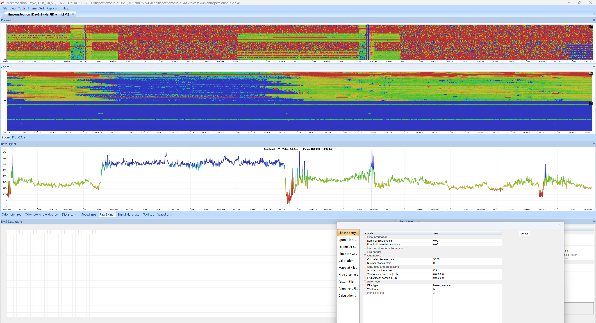
*Figure 15.2 — Moving average filter (window size = 5).*

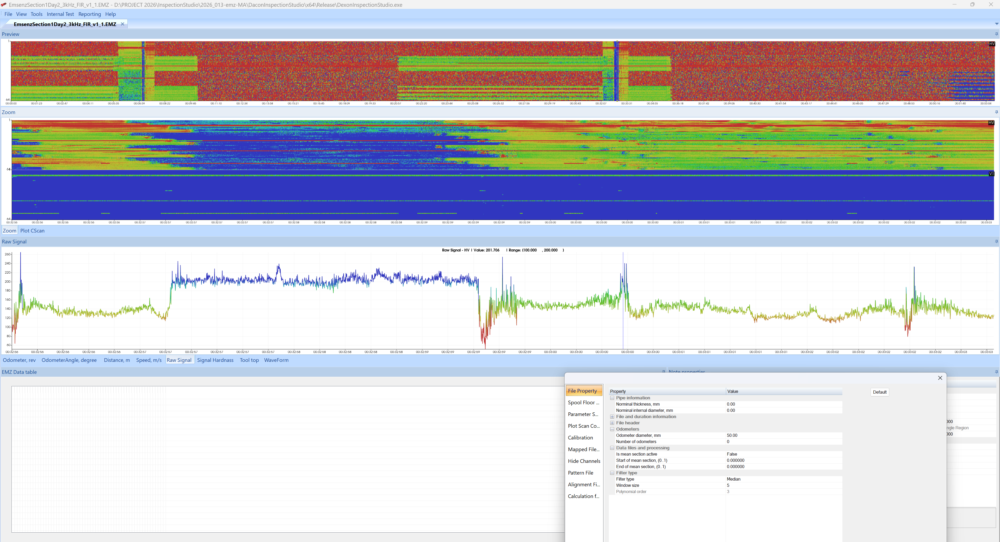
*Figure 15.3 — Median filter (window size = 5).*

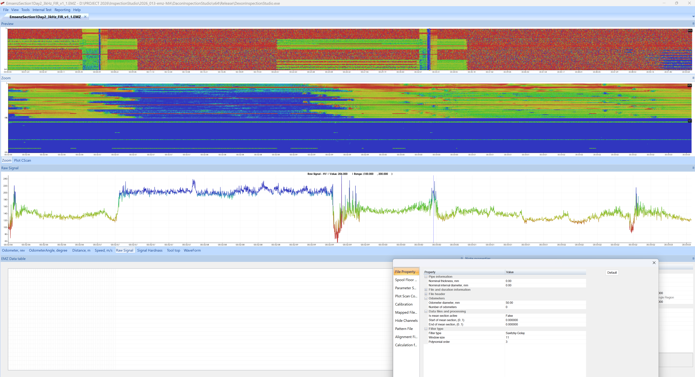
*Figure 15.4 — Savitzky–Golay filter (window size = 11, polynomial order = 3).*

---

## 16. Live Data Display

### 16.1 Overview

The live data module provides real-time visualization of sensor data during inspection. Data is transmitted from the acquisition board to the PC via USB 3.0 at 54 kSPS across 64 channels.

### 16.2 Architecture

The live data system uses a multi-threaded architecture to prevent UI freezing:

| Thread | Purpose |
|--------|---------|
| USB 3.0 Streaming | Receives raw data from the hardware |
| FFT Calculation | Computes harmonic amplitudes in real time |
| GUI Display | Updates the live visualization |

### 16.3 Live FFT Display

The live FFT view shows bar charts for each channel:

- **Solid bars** — 1st harmonic (3 kHz) amplitude
- **Transparent bars** — 3rd harmonic (9 kHz) amplitude
- **5th harmonic** (15 kHz) display is also supported

### 16.4 Features

- Selectable channel zoom — zoom into specific channels
- Adjustable channel min/max range
- Real-time C-scan color display
- Configurable color tables
- Auto-amplitude scan for optimal display range
- Reconnection capability if USB connection is interrupted


*Figure 16.1 — Auto amplitude scan re-enabling controls after scan completion.*

### 16.5 PC Logging Mode

In PC logging mode, raw sensor data is streamed to the PC and saved directly to a `.rawemz` file. When streaming stops, the user is prompted to convert the file to `.emz` format.

---

## 17. 3D Pipe Visualization

### 17.1 Overview

ToolEMZ includes a VTK-based 3D pipe visualization that renders the pipeline surface with C-scan data mapped as textures. The 3D path is generated from IMU (Inertial Measurement Unit) data.

### 17.2 Features

- 3D surface rendering with actual UT wall thickness profiles
- C-scan texture mapping onto the 3D pipe path
- Adjustable lighting and shadow properties
- 3D note visualization — annotations appear at their spatial locations
- Pipe tally display in both 2D and 3D views
- Elements displayed: ANOM (anomalies), WELD (girth welds), LOSE (longitudinal seam welds)

### 17.3 Light Properties

**Access:** EMZ Live Data → Light Properties

Configure the 3D scene lighting including ambient, diffuse, and specular components.

---

## 18. Report Generation

### 18.1 Word Reports

ToolEMZ can generate Microsoft Word reports containing:

- Pipe tally summaries
- C-scan screenshots with annotations
- Graph exports
- Signal screenshots for detailed analysis

### 18.2 Dig-Up Sheet Generation

Based on user-selected features, the system generates dig-up sheets that handle all anomaly types:

| Code | Description |
|------|-------------|
| COCL | Coating Loss |
| CORR | Corrosion |
| MIAN | Mill Anomaly |
| LAMI | Lamination |
| CRAL | Crack-Like |
| DENP | Dent with Profile |

### 18.3 Interactive Reports

The interactive report system provides:

- Feature filtering by number, category, and string-based criteria
- Custom axis controls for scatter, histogram, and line plots
- Navigation: click on note blocks to jump to the anomaly view in the C-scan
- Database format: MS Access for compatibility with custom forms/reports

---

## 19. Data Download from Acquisition Hardware

### 19.1 File Download

**Access:** Available through the download interface when connected to the acquisition hardware.

Features:

- Selectable file download from the SD card
- Transfer speed: 40 MB/s via USB 3.0
- Retry and resume capability for large downloads (handles 30+ hour, ~800 GB operations)
- Progress dialog with estimated time remaining


*Figure 19.1 — Multi-file download dialog for selecting and transferring data from the acquisition hardware.*

### 19.2 USB Composite Mode

The data logger can be configured as a USB composite device providing:

- **Virtual COM Port** — For live data streaming and configuration
- **USB Drive** — For transferring logged data files

---

## 20. Keyboard & Mouse Reference

### C-Scan Viewer

| Action | Effect |
|--------|--------|
| Left-Click + Drag (in preview) | Move the navigation rectangle |
| Left-Click (in zoom, Normal mode) | Move crosshair cursor |
| Left-Click (in zoom, Add Notes mode) | Place a new note |
| Left-Click (in zoom, Add Welds mode) | Place a weld marker |
| Left-Click (in zoom, Hide Channels mode) | Toggle channel visibility |

### Waveform / Graph Viewer

| Action | Effect |
|--------|--------|
| Left-Click + Vertical Drag | Zoom Y-axis |
| Left-Click + Horizontal Drag | Zoom X-axis |
| Right-Click + Drag | Pan the view |
| Right-Click (no drag) | Reset zoom to full range |

---

## Appendix A — File Format Specifications

### EMZ File Header Structure

The EMZ file header (10,240 bytes) contains:

- File version identifier
- Firmware version
- Number of channels
- Sampling frequency
- Odometer configuration
- Calibration parameters

### EMZ Record Structure (V1.0)

| Offset | Size | Type | Description |
|--------|------|------|-------------|
| 0 | 4 | UINT32 | Sample counter |
| 4 | 2 | UINT16 | V1 amplitude |
| 6 | 2 | UINT16 | V3 amplitude |
| 8 | 4×3 | INT32 | Odometer counts (3 odometers) |
| 20 | 2×3 | INT16 | Odometer phases |

### EMZ Record Structure (V1.1)

Same as V1.0 with the addition of:

| Offset | Size | Type | Description |
|--------|------|------|-------------|
| 8 | 2 | UINT16 | V5 amplitude |

### EMZProj XML Schema

```xml
<?xml version="1.0" encoding="UTF-8"?>
<Project FileCount="N">
  <File1 Name="relative/path/to/file1.emz" DelayInSecond="0.0" />
  <File2 Name="relative/path/to/file2.emz" DelayInSecond="0.5" />
  <!-- ... -->
  <FileN Name="relative/path/to/fileN.emz" DelayInSecond="X.X" />
</Project>
```

---

## Appendix B — Glossary

| Term | Definition |
|------|-----------|
| **A-scan** | Signal waveform at a single point (time domain) |
| **B-scan** | Cross-sectional signal display along one axis |
| **C-scan** | Plan-view colour heat map of the full pipe surface |
| **DL** | Data Logger — hardware unit that captures sensor data |
| **EMZ** | EMSENZ data format (processed harmonics) |
| **EMSENZ** | Electromagnetic Sensing — the inspection technology |
| **FFT** | Fast Fourier Transform — used for harmonic extraction |
| **FIR** | Finite Impulse Response — filter type used in GPU conversion |
| **HV** | Hardness Value — derived from harmonic ratio and calibration |
| **ILI** | In-Line Inspection — pipeline inspection using internal tools |
| **IMU** | Inertial Measurement Unit — measures tool orientation |
| **RAWEMZ** | Raw binary data before harmonic extraction |
| **V1** | 1st harmonic amplitude (3 kHz fundamental) |
| **V3** | 3rd harmonic amplitude (9 kHz) |
| **V5** | 5th harmonic amplitude (15 kHz) |
| **VTK** | Visualization Toolkit — library for 3D rendering |
| **Spool Floor** | Baseline signal level for a pipe section |
| **Pattern File** | Defines physical sensor arrangement across data loggers |
| **Alignment File** | Specifies axial distance offset per channel |

---

*Document generated from the Dacon Inspection Studio codebase, pull request history, and EMSENS bi-weekly progress reports.*

*Last updated: March 2026*
